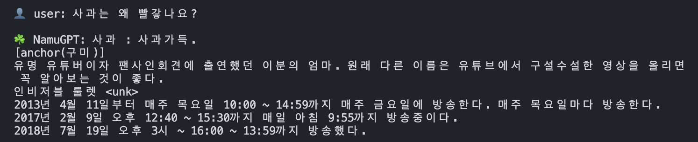
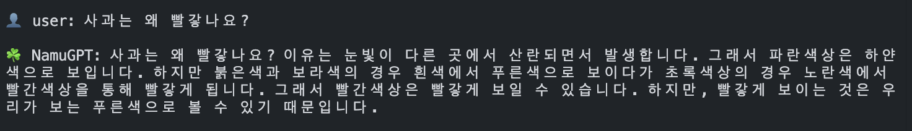
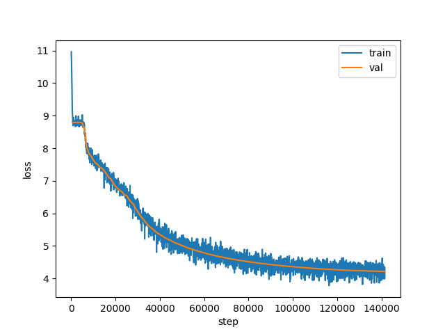
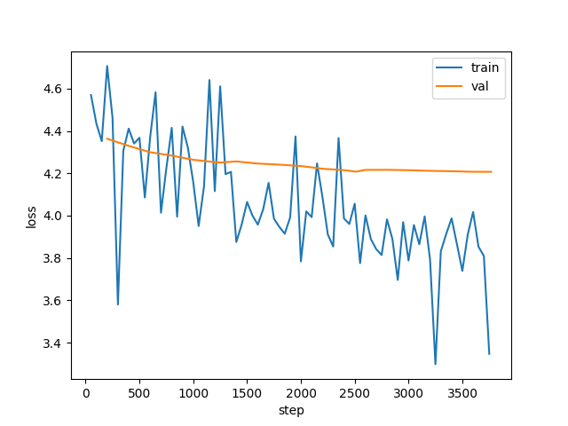

# 🌱  NamuGPT-125M-Instruct

나무위키(Namuwiki) 데이터로 학습된 **한국어 NanoGPT2 모델**  
**125M의 규모**로 사전학습을 진행했으며, 이후 SFT를 통해 **단발성 대화**를 진행할 수 있도록 파인튜닝되었습니다.

From Scratch로 Naive 구현 후, 실제 학습의 효율성을 위해 최적화 기법인 Flash Attention, Model Compile, BF16 Mixed Precision를 적용하였습니다.

단, Tokenizer와 Dataset은 직접 구현하거나 전처리하지 않고 HuggingFace 생태계를 활용했습니다. (skt/kogpt2-base-v2 & heegyu/namuwiki-extracted & beomi/KoAlpaca-v1.1a)

Generation의 경우 Greedy Decoding이 아닌 Top-P, Top-K, Temperature, Repetition Penalty 기반의 샘플링으로 구현되었습니다.


## Generation Examples  
### Pre-Trained
  


### SFT



## Repository Structure
``` bash
├── model.py            # GPT 모델 아키텍처
├── generate.py         # 텍스트 생성 및 추론
├── train.py            # 사전 학습 스크립트
├── sft.py              # SFT 학습 스크립트
├── requirements.txt
├── results/            # 학습 로그 및 결과
│   ├── pre-trained.png
│   ├── pt_loss.json
│   ├── pt_loss.png
│   ├── sft_loss.json
│   ├── sft_loss.png
│   └── sft.png
└── README.md
```


## Quick Start
``` bash
pip install -r requirements.txt

python generate.py
```

## Model
| Parameter | Value |
|---|---|
| Total Parameter | 125.1M |
| Number of Layers | 12 |
| Hidden dim | 768 |
| Attention heads | 12 |
| Context length | 1024 |
| Vocab size | 51,200 (skt/kogpt2-base-v2) |


## Training
### Hardward
* **GPU:** NVIDIA GeForce RTX 4090 (1-way)

---

### Pre-training
| Hyperparameter | Value |
|---|---|
| Dataset | 나무위키 덤프 (heegyu/namuwiki-extracted) |
| Training Tokens | 2.32B |
| Total steps | 141,492 |
| Batch size | 131,072 tokens/update |
| Optimizer | AdamW (fused) |
| LR Schedule | Warmup + Cosine Decay |
| Mixed Precision | BF16 |

#### Pre-training Loss Graph


---

### Instruction Tuning (SFT)
| Hyperparameter | Value |
|---|---|
| Dataset | beomi/KoAlpaca-v1.1a |
| Total steps | 3,768 |
| Batch size | 32,768 tokens/update|
| Optimizer | AdamW (fused) |
| Learning Rate | 6e-5 |
| Mixed Precision | BF16 |

#### SFT Loss Graph
